## Functional Specifications

This document describes each command, its usage and permission scope.

The functionality of all commands is implemented as functions in corresponding code files in the `abstract_commands` directory. This is to allow for both easier testing and usage from the website interface.

Note: The terms guild and server are used interchangeably.

Note: In a lot of the places, there are phrases like "This command should only show a match which is on a leaderboard that belongs to the server that this command runs in". What this basically means is that since the `uuid` of a match is universally unique (hence the name **uu**id) a user can potentially request to show a match with a `uuid` which was played in a different server. This should not work, and correctly return an error stating that the match was not found!

Note: These specifications are currently ignored due to development purposes, but it is really easy to add them in the finished product:
1. To run admin commands, a user must either have the `Manage Channel` permission, or have the `admin role`.
2. To run moderator commands, a user must either have the `Manage Channel` permission or have the `mod role`.

### Admin Commands

1. `create_q`
    1. Purpose: This command creates a new queue in the channel that it is used in.
    2. Constraints: This command must be used inside a channel in a guild.
    3. Actors: Admins
    4. Parameters:
        1. name: The name of the queue.
        2. num_players: The max number of players for the queue.
    5. Normal Flow: A new `Queue` object is created and saved in the database.
    6. Alternate Flow: An error is returned if the command is run outside a server text channel.
    7. Sequence Diagram: 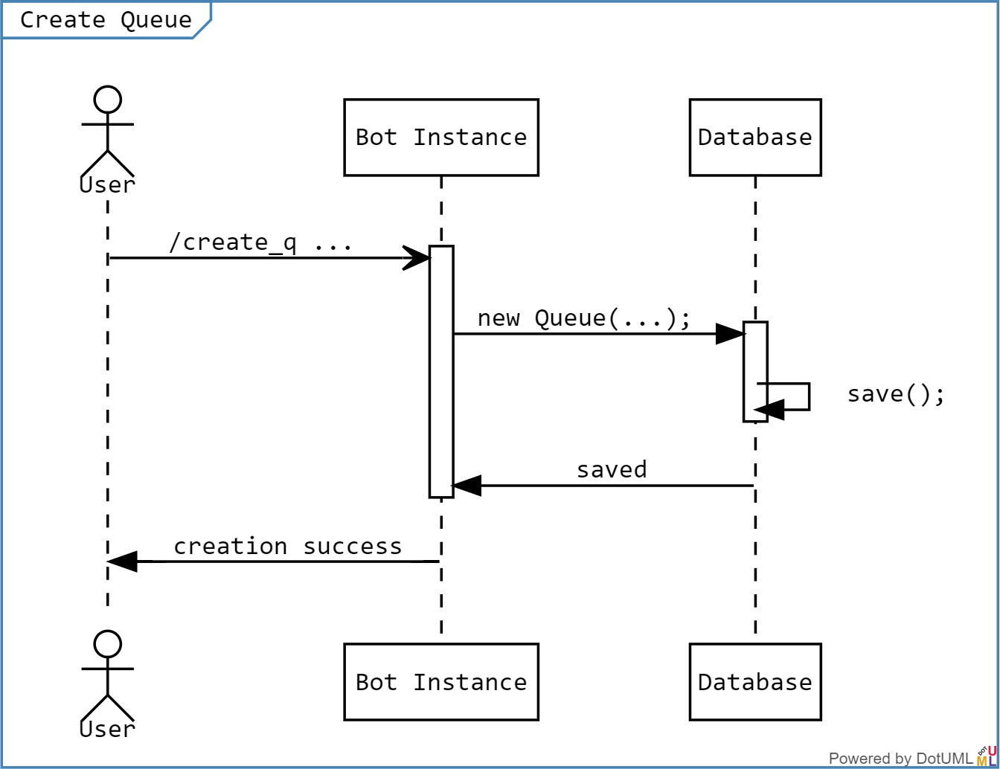
    
2. `delete_q`
    1. Purpose: This command deletes a queue in a channel.
    2. Constraints: This command can only delete queues that were created in the channel that it is run in.
    3. Actors: Admins
    4. Parameters:
        1. uuid: The ID of the queue to delete.
    5. Normal Flow: A `Queue` object with the provided `uuid` should be fetched and removed from the database.
    6. Alternate Flow: An error is returned if the uuid specified does not belong to a queue in the channel that this command is run in.
    7. Sequence Diagram: 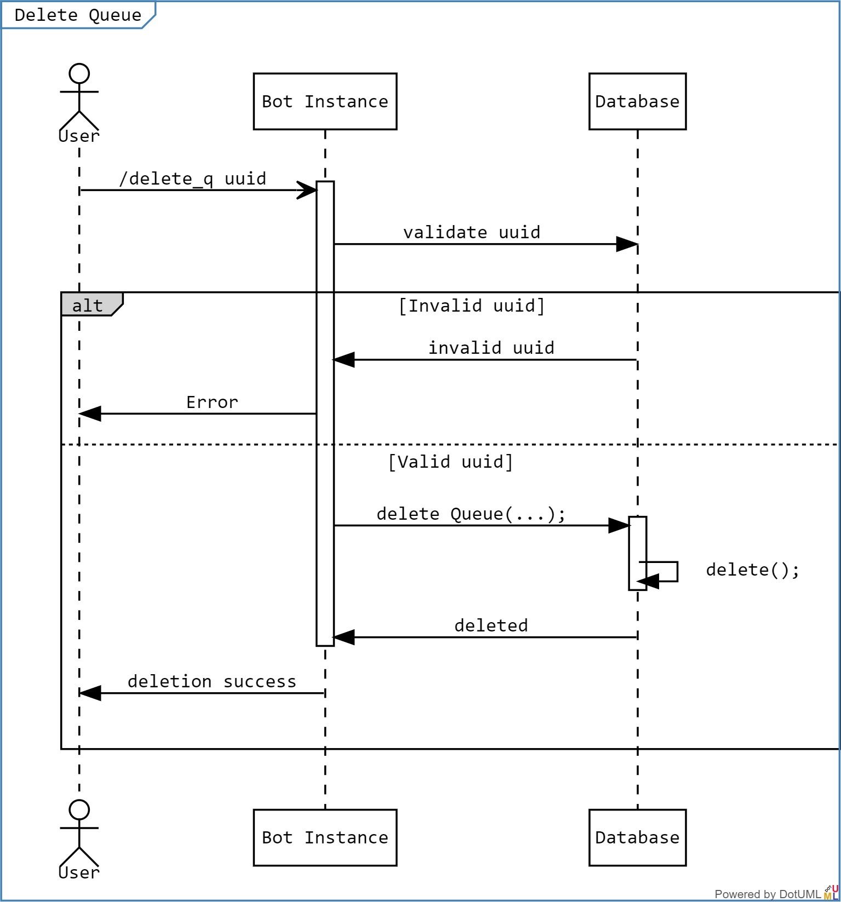
    
3. `edit_q`
    1. Purpose: This command can be used to edit the settings of a queue.
    2. Constraints: This command can only edit queues in the channel that this command is run in.
    3. Actors: Admins
    4. Parameters:
        1. queue_uuid: The `uuid` of the queue to modify..\
        2. name: (optional) The new name of the queue. If unspecified, the name is not changed.
        3. num_players: (optional) The new number of players for the queue. If unspecified, the number of players are not changed.
    5. Normal Flow: the `Queue` instance with the given `uuid` is fetched from the database, modified if necessary and saved back.
    6. Alternate Flow: return an appropriate message if the queue `uuid` specified is not valid or exists in a different channel than in which this command is run.
    7. Sequence Diagram: 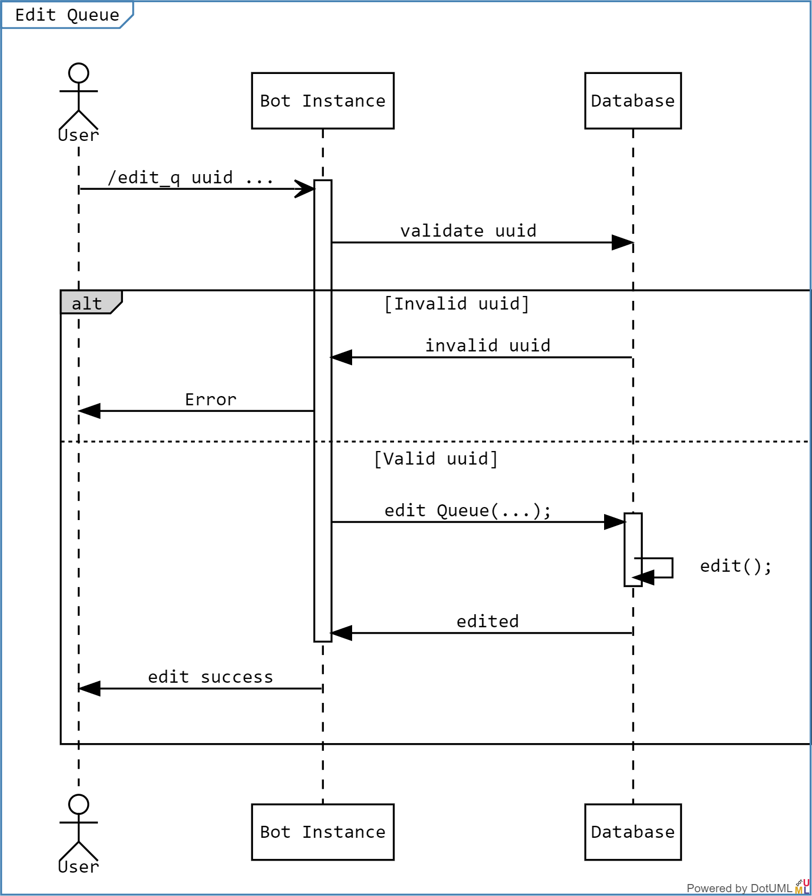
    
4. `set_logging_channel`
    1. Purpose: This command sets a logging channel in a server.
    2. Constraints: This command needs to be run in the channel which the user wants to set as the logging channel.
    3. Actors: Admins
    4. Parameters:
    5. Normal Flow: Fetch the `Guild` instance of the guild where this command is run. Set the `loggingChannelId` on the guild instance and save the `Guild` object. (All commands and website interface actions must be properly logged in this channel, a logging class needs to be implemented!)
    
5. `set_admin_role`
    1. Purpose: This command sets a role as the admin role for the server. A user with this role on the server will be allowed to run all admin and moderator commands.
    2. Constraints: This command can only set the role for a particular server.
    3. Actors: Admins
    4. Parameters:
        1. role: The role to set as the admin role.
    5. Normal Flow: Fetch the `Guild` instance of the guild where this command is run. Set the `adminRoleId` on the guild instance and save the `Guild` object.
    
6. `set_mod_role`
    1. Purpose: This command sets a role as the mod role for the server. A user with this role on the server will be allowed to run all mod commands.
    2. Constraints: This command can only set the role for a particular server.
    3. Actors: Admins
    4. Parameters:
        1. role: The role to set as the mod role.
    5. Normal Flow: Fetch the `Guild` instance of the guild where this command is run. Set the `modRoleId` on the guild instance and save the `Guild` object.
    
7. `set_promote_role`
    1. Purpose: This command sets a role as the promotion role for the server. A user with this role on the server will be pinged by the bot.
    2. Constraints: This command can only set the role for a particular server.
    3. Actors: Admins
    4. Parameters:
        1. role: The role to set as the promotion role.
    5. Normal Flow: Fetch the `Guild` instance of the guild where this command is run. Set the `promotionRoleId` on the guild instance and save the `Guild` object.
    
8. `set_promote_cd`
    1. Purpose: This command sets the promotion cooldown.
    2. Constraints: This command can only set the cooldown for a particular server.
    3. Actors: Admins
    4. Parameters:
        1. duration: The duration for the cooldown `hh:mm[:ss]`.
    5. Normal Flow: Fetch the `Guild` instance of the guild where this command is run. Set the `promotion duration`on the guild instance and save the `Guild` object.
    6. Alternate Flow: Return an appropriate error message if the format used is incorrect.
    
9. `add_map` 
    1. Purpose: This adds a map to a pool.
    
    2. Constraints: This command can only create a map to a pool in a sever.
    
    3. Actors: Admins
    
    4. Parameters:
        1. map_uuid: The uuid of the map.
        2. pool_uuid: The uuid of the pool.
        3. multiplier: The number of players for this map in the pool, if unspecified will be set to 1.
    
    5. Normal Flow: Fetch the `Guild` instance of the guild where this command is run. Fetch the `GameMap` and `Pool` instances, set the `multiplier` of the map, and save the `PoolMap` object to the database.
    
    6. Alternate Flow: Return an appropriate error message if the map or the pool is not found, or, the map is already in the pool.
    
    7. Sequence Diagram: 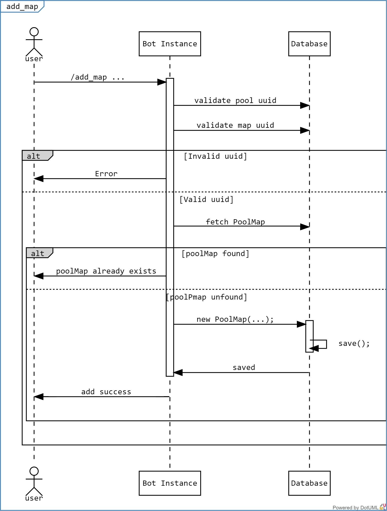
    
       
    
10. `create_pool`
    1. Purpose: This command creates a pool.
    2. Constraints: This command can only create a pool for a server.
    3. Actors: Admins
    4. Parameters:
        1. name: The name of the pool.
    5. Normal Flow: Fetch the `Guild` instance of the guild where this command is run. Set the `name` of the map and save the `Pool` object.
    6. Alternate Flow: Return an appropriate error message if the input format is incorrect.
    7. Sequence Diagram: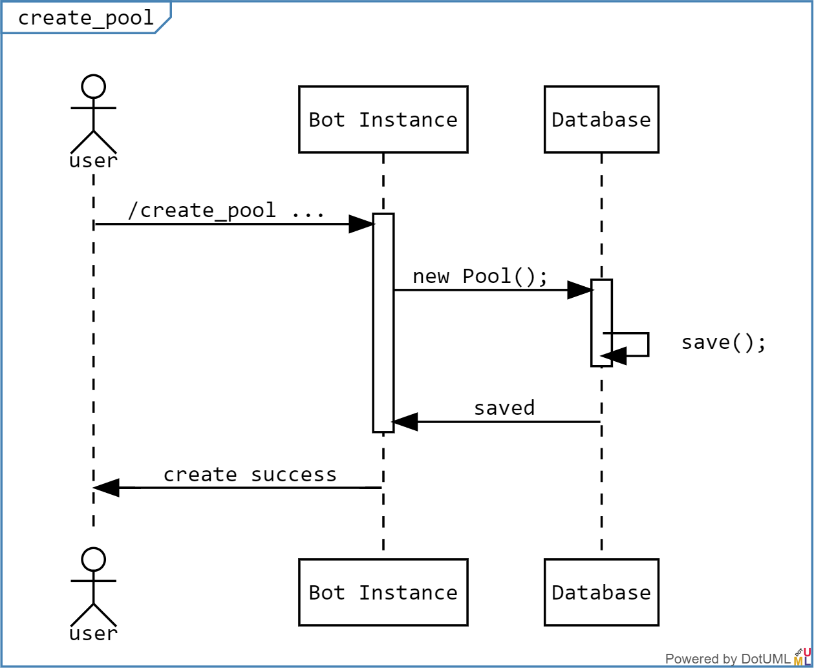

11. `create_map`

      1. Purpose: This command creates a map.

    2. Constraints: This command can only create a map for a particular server.

    3. Actors: Admins
         4. Parameters:
               1. name: The name of the map.

    4. Normal Flow: Fetch the `Guild` instance of the guild where this command is run. Set the `name` and `img_link` of the map, saving the `GameMap` object.

    5. Alternate Flow: Return an appropriate error message if the input format is incorrect.

    6. Sequence Diagram: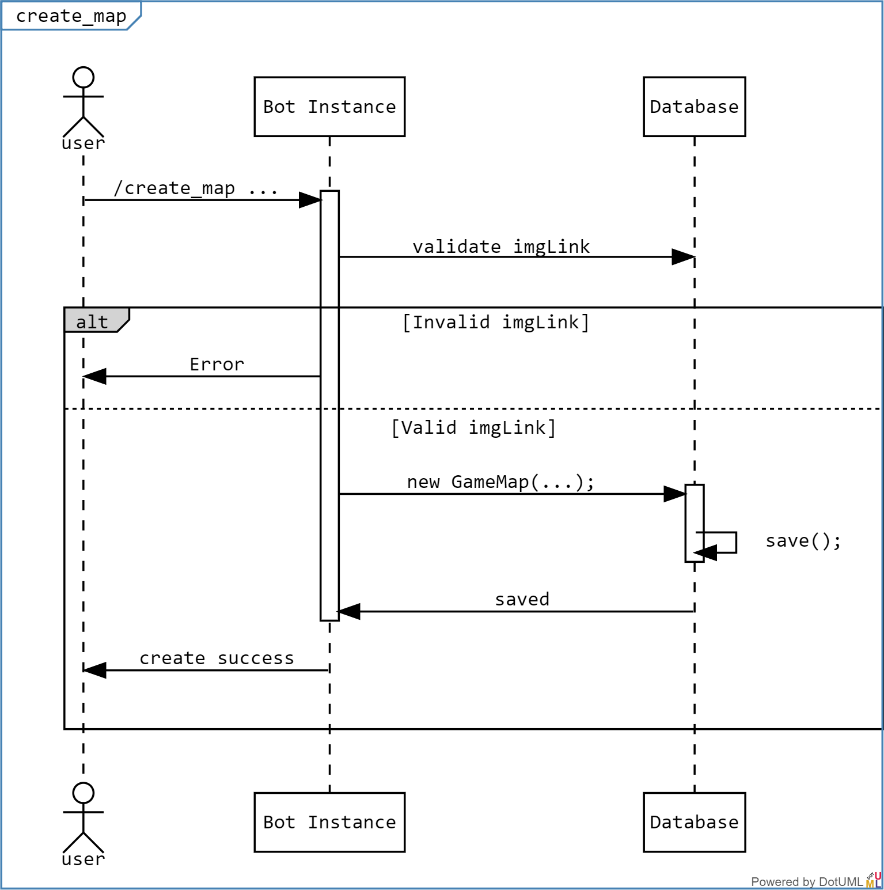

12. `edit_pool`

    1. Purpose: This command can be used to edit the information of a pool.

    2. Constraints: This command can only edit pools in the server that this command is running in.

    3. Actors: Admins
       4. Parameters:
          1. uuid: The `uuid` of the pool to modify.
          2. name: The new name of the queue.

    4. Normal Flow: the `Pool` instance with the given `uuid` is fetched from the database, modified if necessary and saved back.

    5. Alternate Flow: return an appropriate message if the pool `uuid` specified is not valid or the new `name` is the same as the previous one.

    6. Sequence Diagram: 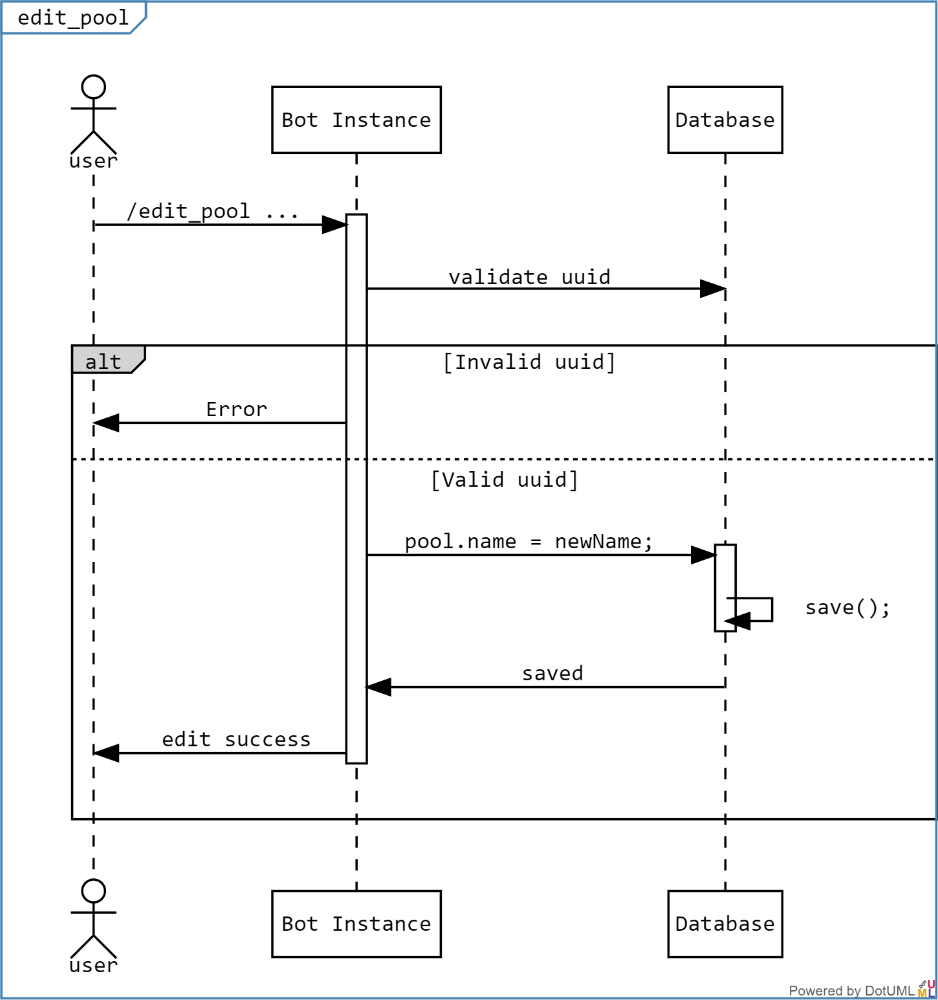

13. `edit_map`

    1. Purpose: This command can be used to edit the information of a map.

    2. Constraints: This command can only edit maps in the server that this command is running in.

    3. Actors: Admins

    4. Parameters:

         1. uuid: The `uuid` of the map to modify.

       2. name: The new name of the map.

    5. Normal Flow: the `GameMap` instance with the given `uuid` is fetched from the database, modified if necessary and saved back.

    6. Alternate Flow: return an appropriate message if the map `uuid` specified is not valid or the new `name` is the same as the previous one.

    7. Sequence Diagram: 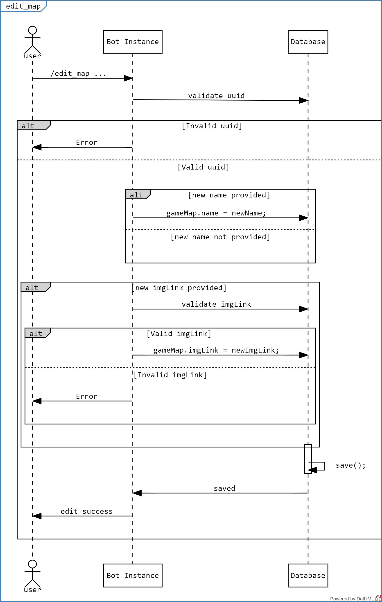

14. `delete_pool` 

      1. Purpose: This command deletes a pool from the server.

    2. Constraints: This command can only delete a pool for a particular server.

    3. Actors: Admins

    4. Parameters:
         1. uuid: The uuid of the pool.

    5. Normal Flow: A `Pool` object with the provided `uuid` should be fetched and removed from the database.

    6. Alternate Flow: An error is returned if the `uuid` specified does not belong to a pool in the server that this command is running in.

    7. Sequence Diagram: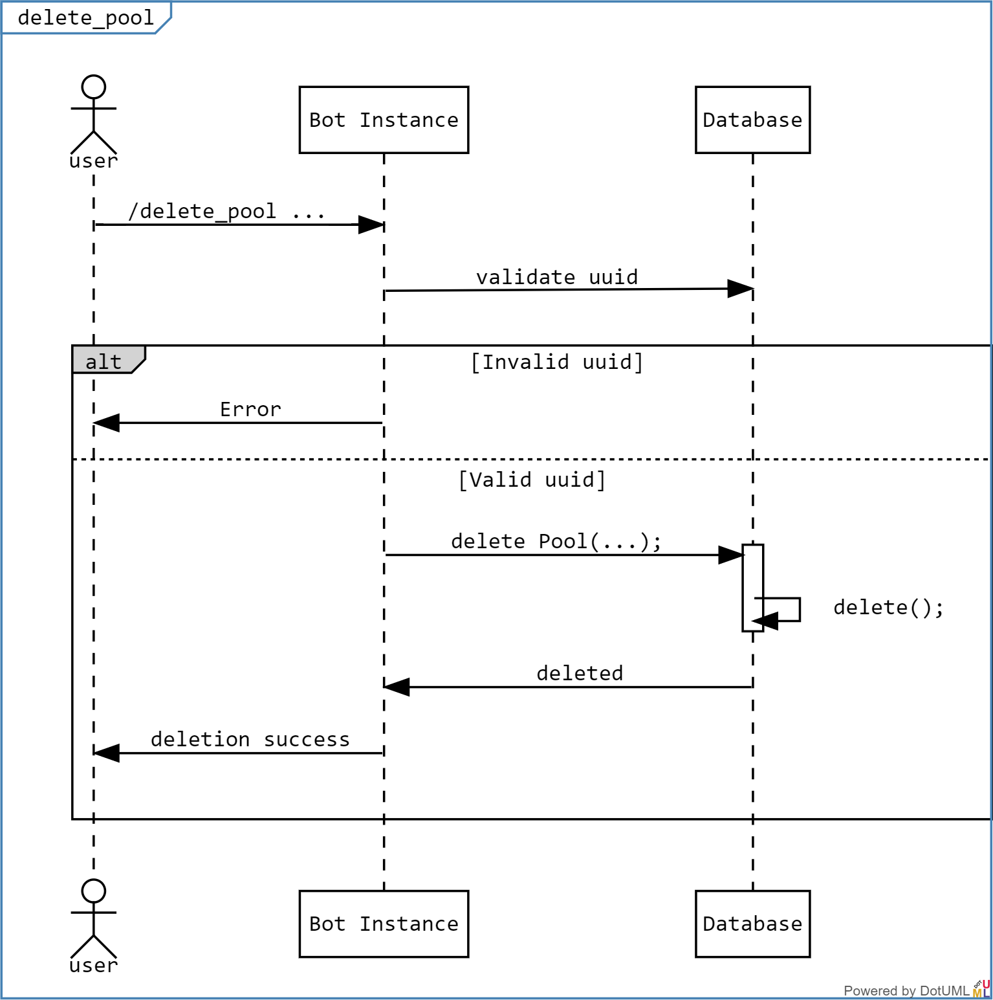

15. `delete_map` 
        1. Purpose: This command deletes a map from the server.
        2. Constraints: This command can only delete a map for a particular server.
        3. Actors: Admins
        4. Parameters:
              1. uuid: The uuid of the map.
        5. Normal Flow: A `GameMap` object with the provided `uuid` should be fetched and removed from the database.
        6. Alternate Flow: An error is returned if the `uuid` specified does not belong to a map in the server that this command is running in.
        7. Sequence Diagram: 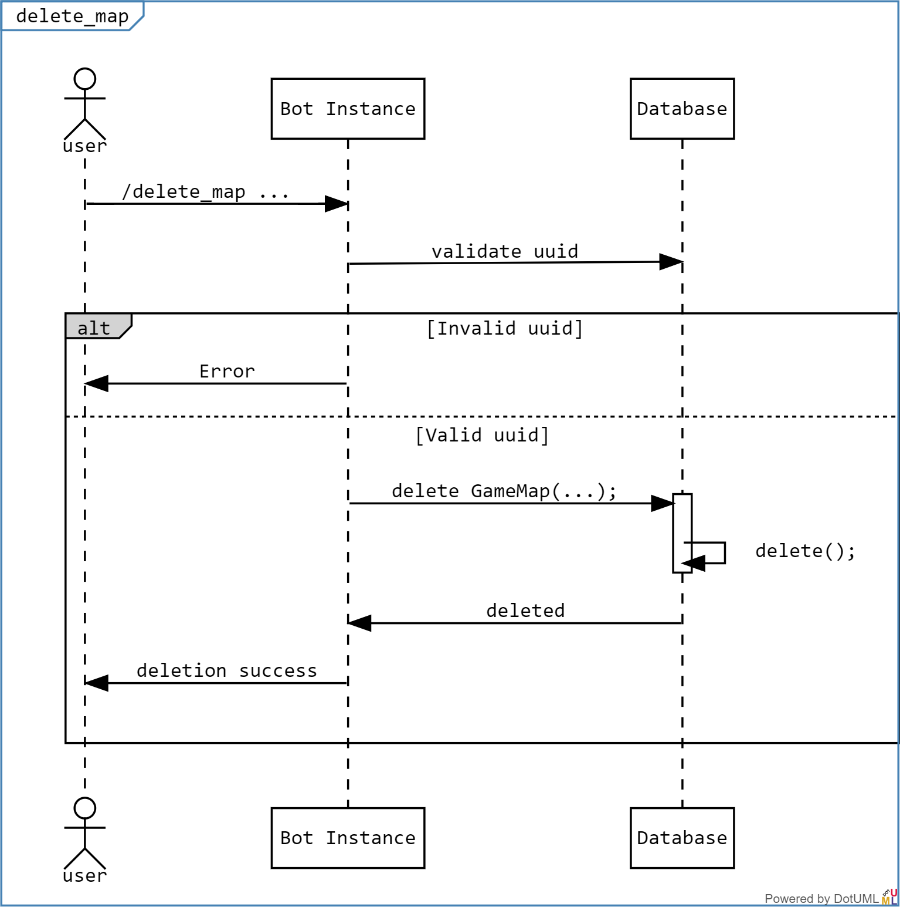

16. `remove_map`
    1. Purpose: This command removes a map from a pool specified in the server.
    2. Constraints: This command can only remove a map for a particular pool in the server.
    3. Actors: Admins
    4. Parameters:
          1. map_uuid: The uuid of the map.
          2. pool_uuid: The uuid of the pool, if unspecified will remove it from all pools.
    5. Normal Flow: A `PoolMap` object with the provided `map_uuid` in the pool with the provided `pool_uuid` should be fetched and removed from the pool.
    6. Alternate Flow: An error is returned if the `map_uuid` specified does not belong to a map or the `pool_uuid` specified does not belong to a pool in the server that this command is run in.
    7. Sequence Diagram: 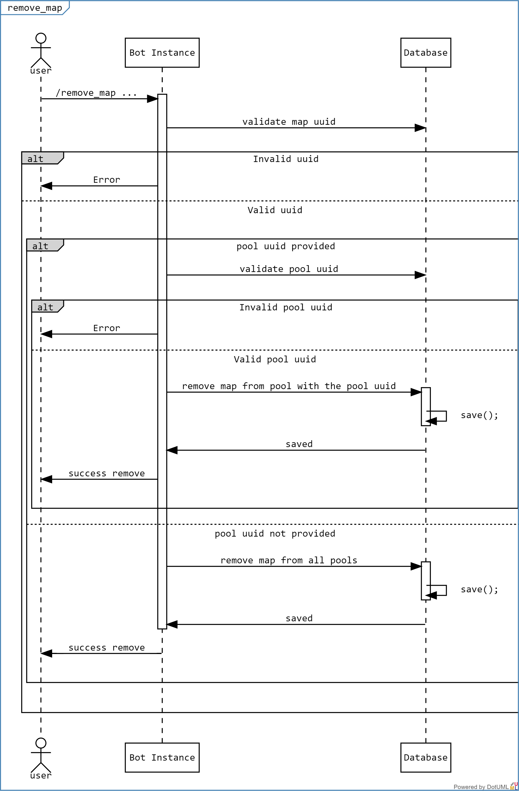

## Mod Commands

1. `rating_set`
    1. Purpose: This command sets the rating of a user for the leaderboard of a particular queue.
    2. Constraints: This command can only set the ratings for the queues in the channel that it is run in.
    3. Actors: Admins, Mods
    4. Parameters:
        1. rating: The new rating of the user.
        2. user: The user to set the rating for.
        3. queue_uuid: (optional) The ID of the queue to delete.
    5. Normal Flow: All the `Queue`s in the channel that this command is run in should be retrieved. If there is a single queue in the channel, use its `Leaderboard` and set the given user's `rating` in the `PlayerStats` object. Save the `PlayerStats` object back to the database.
    6. Alternate Flow 1: If there are more than 1 queues in the channel, ask the user to specify its ID.
    7. Alternate Flow 2 If there are no queues in the channel, return an appropriate error.
    8. Sequence Diagram: 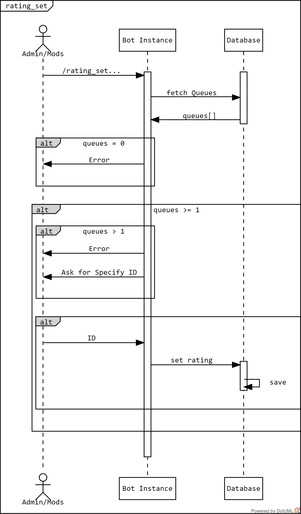

2. `rating_reset`
    1. Purpose: This command resets the ratings of all the users in the server back to the default `1000`.
    2. Constraints: This command can only reset the ratings for the leaderboards in the server that this command is run in.
    3. Actors: Admins, Mods
    4. Parameters:
        1. user: (optional): If specified, reset the ratings only for this user.
        2. leaderboard_uuid: (optional) If specified, reset the ratings only for this leaderboard.
    5. Normal Flow: Ask for confirmation from the user if they really want to reset ratings. If yes, set all the `rating` values for all the `PlayerStats` lists of all the `Leaderboard` instances in the server to `1000`. Save the modified `PlayerStats` and `Leaderboard` instances back to the database.
    6. Sequence Diagram: 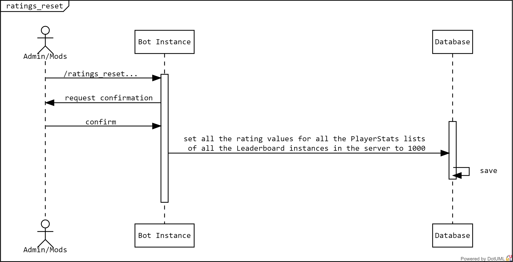

2. `stats_reset`
    1. Purpose: This command resets all the statistics of all the users in the server.
    2. Constraints: This command can only reset the stats for the leaderboards in the server that this command is run in.
    3. Actors: Admins, Mods
    4. Parameters:
        1. user: (optional): If specified, reset the stats only for this user.
        2. leaderboard_uuid: (optional) If specified, reset the ratings only for this leaderboard.
    5. Normal Flow: Ask for confirmation from the user if they really want to reset stats. If yes, set all the `numGames` etc. values for all the `PlayerStats` lists of all the `Leaderboard` instances in the server to `0`. Save the modified `PlayerStats` and `Leaderboard` instances back to the database.
    6. Sequence Diagram: 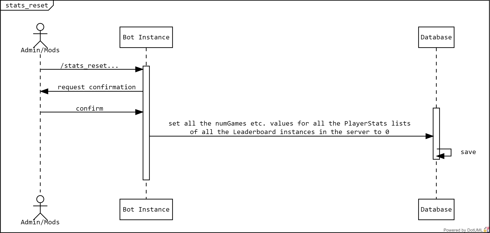

3. `ban`
    1. Purpose: This command bans a user from joining queues.
    2. Constraints: This command can only ban users from joining queues in a particular server.
    3. Actors: Admins, Mods
    4. Parameters:
        1. user: The user to ban.
        2. duration: (optional) if unspecified, permanently ban the user. String, in `hh:mm[:ss]` format.
        3. for: (optional) The reason for banning the user.
    5. Normal Flow: A new `Ban` instance is created, the duration is converted to seconds and added to the current epoch timestamp and saved in `Ban.until`. Save the ban instance in the database.
    6. Alternate Flow 1: If the user specified is invalid, return an appropriate error.
    7. Alternate Flow 2 If the duration specified is in an invalid format, return an appropriate error.
    8. Sequence Diagram: 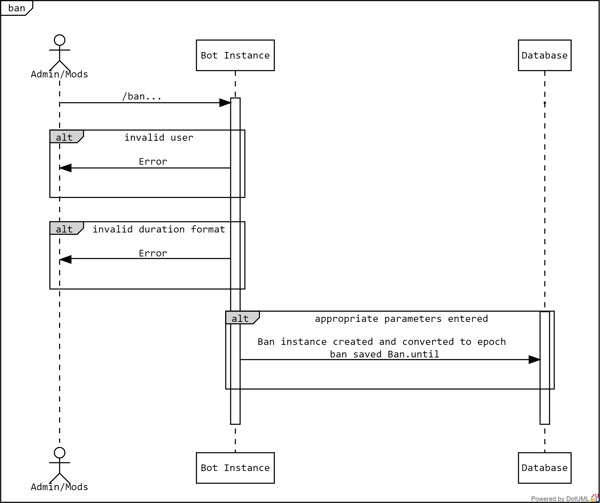

4. `unban`
    1. Purpose: This command removes the ban from a user to join a queue.
    2. Constraints: This command can only unban users from joining queues in a particular server.
    3. Actors: Admins, Mods
    4. Parameters:
        1. user: The user to unban.
    5. Normal Flow: The `Ban` instance for the specified `user` (and `guild`) is fetched from the database and removed.
    6. Alternate Flow 1: If the user specified is invalid, return an appropriate error.
    7. Alternate Flow 2 If the timestamp of the `Ban.until` is already passed or there is no ban entry for the user specified, return an error saying that the user is not banned.
    8. Sequence Diagram: 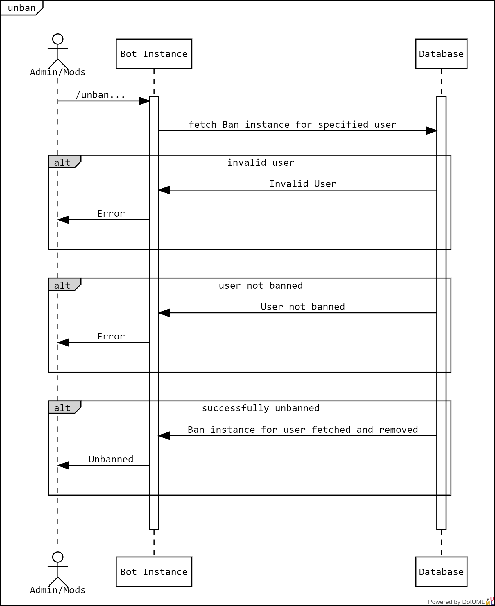

5. `report_win`
    1. Purpose: This command can be used to report the winning team for a game.
    2. Constraints: This command can only report the wins for matches happening in a queue in the same channel as the one where this command is run.
    3. Actors: Admins, Mods
    4. Parameters:
        1. match_uuid: The match to report the result for.
        2. team: The number of the team that won. (`minValue = 1`, `maxValue = 2`)
        3. overwrite: (default: `false`) if true, this will overwrite the result of the match even if it has already been registered
    5. Normal Flow: The `Match` instance with the given `uuid` is fetched and the result is stored in the `winningTeam` attribute and saved. The ratings of all the players are adjusted in the `PlayerStats` object to reflect the outcome of the match. Save all the modified database objects.
    6. Alternate Flow 1: If the provided `match_uuid` is invalid, return an appropriate error message.
    7. Alternate Flow 2 If the result for the match for the provided `match_uuid` is already registered, return an appropriate message if `overwrite` is set to `false`.
    8. Alternate Flow 3 If `overwrite` is set to `true`, then store the new result for the match and re-calculate the elo changes for every player and reflect them in the appropriate `PlayerStats` object (the elo BEFORE the match started are stored in the player objects in every match, so this should be trivial).
    9. Sequence Diagram: 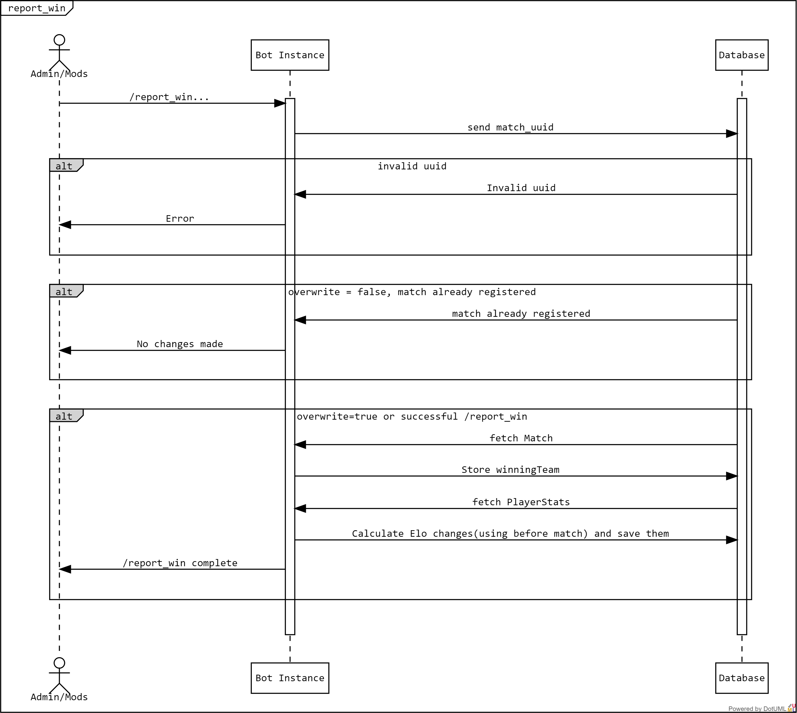

6. `cancel_match`
    1. Purpose: This command can be used to void the result of a match or cancel an ongoing match.
    2. Constraints: This command can only cancel matches happening in a queue in the same channel as the one where this command is run.
    3. Actors: Admins, Mods
    4. Parameters:
        1. match_uuid: The match to cancel.
    5. Normal Flow: The `Match` instance with the given `uuid` is fetched and if its result has already been registered, undo the rating changes and `numGames` etc. changes to the appropriate `PlayerStats` objects. Remove the match object from the database.
    6. Alternate Flow 1: If the provided `match_uuid` is invalid, return an appropriate error message.
    7. Alternate Flow 2 If the result for the match for the provided `match_uuid` is already registered, return an appropriate message.
    8. Sequence Diagram: 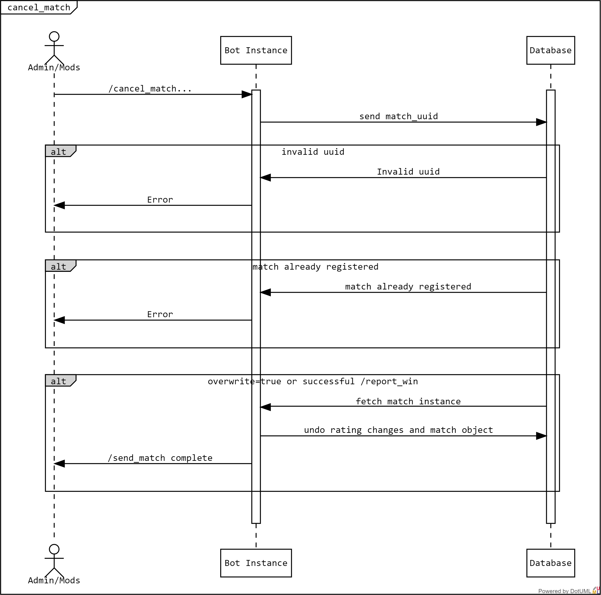

7. `reset`
    1. Purpose: This command removes all players from all the queues in the server.
    2. Constraints: This command can only reset the queues on a particular server
    3. Actors: Admins, Mods
    4. Parameters:
    5. Normal Flow: Fetch all the `Queue`s of the guild where this command is run. Remove all the users from all the queues obtained. Save the queues back to the database.
    6. Sequence Diagram: 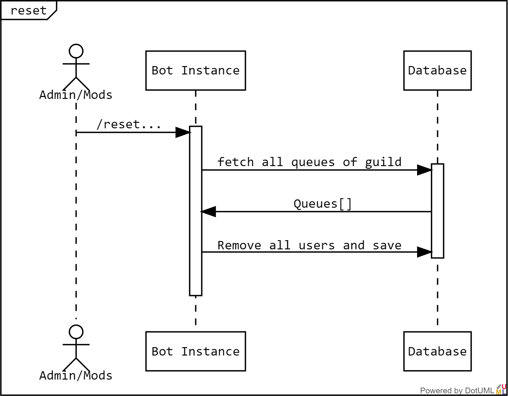
### Captain Commands

A captain is a player/user

1. `report_loss`
    1. Purpose: This command can be used by to report the losing team for a game.
    2. Constraints: This command must be used by an admin, mod or captain who is currently in an ongoing match.
    3. Actors: Admins, Mods, Captains
    4. Parameters:
    5. Normal Flow: The `currentMatch` instance for the usernof this command is fetched and the result is stored in the `winningTeam` attribute and saved. The ratings of all the players are adjusted in the `PlayerStats` object to reflect the outcome of the match.
    6. Alternate Flow 1: If the provided `match_uuid` is invalid, return an appropriate error message.
    7. Alternate Flow 2 If the result for the match for the provided `match_uuid` is already registered, return an appropriate message if `overwrite` is set to `false`.
    8. Alternate Flow 3 If `overwrite` is set to `true`, then store the new result for the match and re-calculate the elo changes for every player and reflect them in the appropriate `PlayerStats` object (the elo BEFORE the match started are stored in the player objects in every match, so this should be trivial).

### Player/User Commands

1. `list_q`
    1. Purpose: This command shows all the queues in a server. This shows a possibly paged embed
    2. Constraints: This command must be used in a channel in a guild.
    3. Actors: Admins, Mods, Users.
    4. Parameters:
        1. all: (default: `true`) If false, only the queues in the current channel are shown.
        2. show_leaderboard_id: (default: `false`) If true, show the leaderboard IDs for the queue.
        3. show_pool_ids: (default: `false`) If true, show the pool IDs for the queue.
    5. Normal Flow: Show an embed with all the queues in the server.
    6. Alternate Flow: If no queues are found in the server, show a relevant message.
    7. Sequence Diagram: 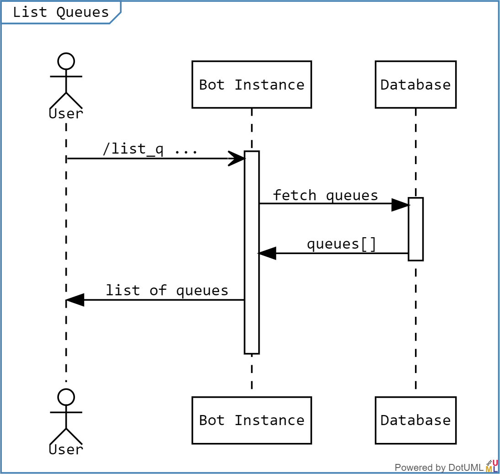
2. `join`
    1. Purpose: This command allows a user to join a queue in the channel that this command is run in.
    2. Constraints: This command must be used in a channel in a guild.
    3. Actors: Admins, Mods, Users.
    4. Parameters:
        1. queue_uuid: (optional) put the user in the queue with this `uuid`. Useful when there are multiple queues in a single channel only.
        2. user: (optional) This is for use by admins/mods only. Add this user to the queue instead of the user of this command.
    5. Normal Flow: All the queues in the channel where this command is used are fetched. If there is just one queue, add the user to that queue. If there are multiple queues, fetch the queue default for the user for this channel and join the `defaultQ` or the `lastQ` in that priority. Save the queue back to the database.
    6. Alternate Flow 1: If none of the `defaultQ` or `lastQ`s are defined and the `queue_uuid` parameter is unspecified, return a message asking the user to specify it.
    7. Alternate Flow 2 If no queues are found in the channel, show a relevant message.
    8. Additional Flow: When the number of users in the queue are == `numPlayers` of the queue, then start a match in that queue. When a match is started, remove all the users from any other queues that they are in, *even queues that are on other servers*
    9. Sequence Diagram: 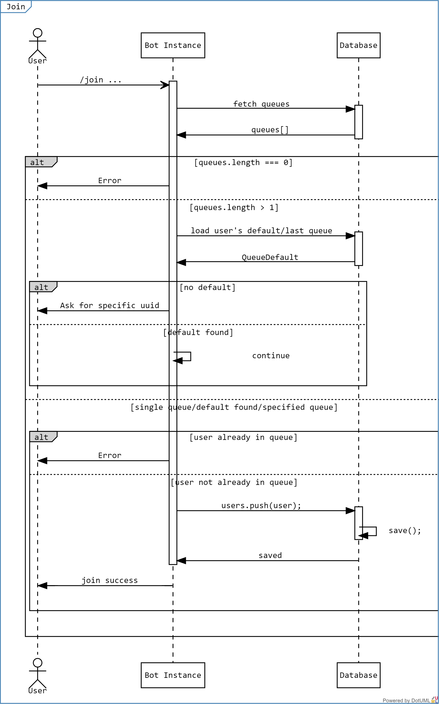
3. `leave`
    1. Purpose: This command allows a user to leave a queue in the channel that this command is run in.
    2. Constraints: This command must be used in a channel in a guild.
    3. Actors: Admins, Mods, Users.
    4. Parameters:
        1. queue_uuid: (optional) remove the user from the queue with this `uuid`. Useful when there are multiple queues in a single channel only.
        2. user: (optional) This is for use by admins/mods only. Remove this user from the queue instead of the user of this command.
    5. Normal Flow: All the queues in the channel where this command is used are fetched. If there is just one queue, remove the user from that queue. Save the queue back to the database.
    6. Alternate Flow 1: If the channel has multiple queues:
        - The user is in just one queue, leave that queue.
        - The user is in multiple queues, and the `queue_id` is not specified - show a message asking the user to specify which queue they want to leave.
    7. Alternate Flow 2 If no queues are found in the channel, show a relevant message.
    8. Sequence Diagram: 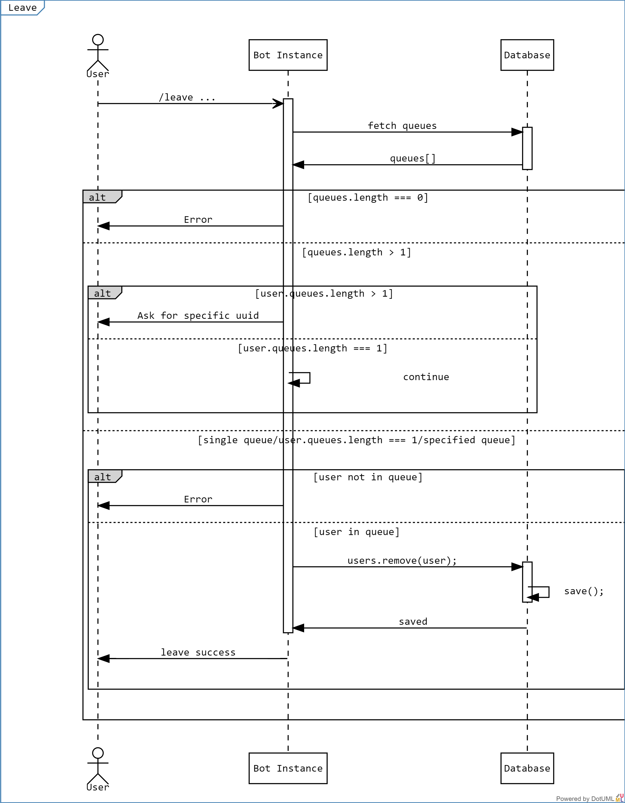
4. `leave_all`
    1. Purpose: This command allows a user to leave all queues in a server.
    2. Constraints: This command must be used in a channel in a guild.
    3. Actors: Admins, Mods, Users.
    4. Parameters:
    5. Normal Flow: Remove the user from all the queues in the guild that this command is run in.
5. `set_default_q`
    1. Purpose: Allow a user to set a queue as their default join queue in a channel.
    2. Constraints: This command must be used in a channel in a guild.
    3. Actors: Admins, Mods, Users.
    4. Parameters:
        1. queue_uuid: Set this queue as the default join queue
    5. Normal Flow: fetch (or create if not present) the `QueueDefaults` for the user and for the channel that this command is run in. set the `defaultQ` property and save the `QueueDefaults` instance back to the database.
6. `list_players`
    1. Purpose: Allow a user to see all the players in a queue. This will show a possible paged embed
    2. Constraints: This command must be used in a channel in a guild, and should only list players from the queues of the channel that this command is used in.
    3. Actors: Admins, Mods, Users.
    4. Parameters:
        1. queue_uuid: (optional) show the players in this queue.
    5. Normal Flow: fetch all the `Queue`s in the channel that this command is used in. If there is just one queue, display an embed with the list of all the players in the queue
    6. Alternate Flow: If there are multiple queues in the channel and `queue_uuid` is not specified, return an appropriate message asking the user to specify the queue for which they want to see the players.
    7. Sequence Diagram: 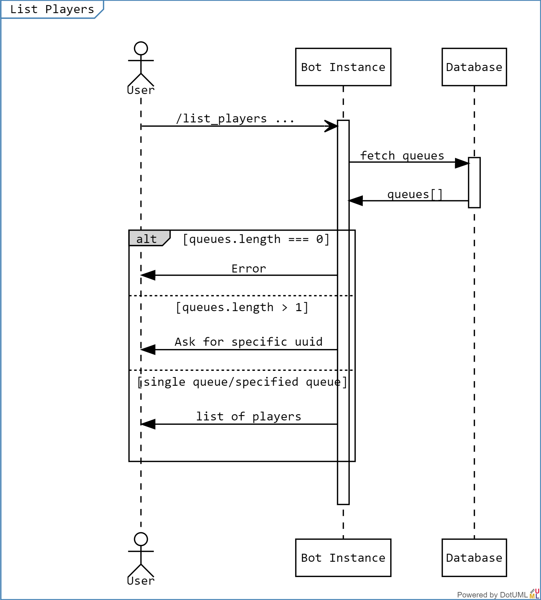
7. `profile`
    1. Purpose: Allow a user to see the profile of a user. This shows the user's rank, rating, total/wins/losses/streak, win rate and the rating changes in the last (max) 5 matches. This will show an embed.
    2. Constraints: This command must be used in a channel in a guild. This command should only show the profiles from the leaderboards in the server that this command is run in.
    3. Actors: Admins, Mods, Users.
    4. Parameters:
        1. user: (optional) show the profile of this user. If unspecified, show the profile of the user that used this command
        2. queue_uuid: (optional) show the profile from the leaderboard of this queue.
        3. leaderboard_uuid: (optional) show the profile from this leaderboard.
    5. Normal Flow: fetch all the `Queue`s in the channel that this command is used in. If there is just one queue, display the profile of the user for the `Leaderboard` of that queue.
    6. Alternate Flow: If there are multiple queues and `queue_uuid` or `leaderboard_uuid` is unspecified, return a message asking the user to specify the `queue_uuid` or the `leaderboard_uuid` that they want to see the profile from.
8. `leaderboard`
    1. Purpose: Allow a user to see the players in leaderboard ranked by rating. Also shows the players `Total/Win/Loss/Streak` counts. This will show a possibly paged embed.
    2. Constraints: This command must be used in a channel in a guild. This command should only show the leaderboards of queues that belong to the server in which this command is run
    3. Actors: Admins, Mods, Users.
    4. Parameters:
        1. queue_uuid: (optional) show the leaderboard of this queue.
        2. leaderboard_uuid: (optional) show this leaderboard.
    5. Normal Flow: fetch all the `Queue`s in the channel that this command is used in. If there is just one queue, display the `Leaderboard` of that queue.
    6. Alternate Flow: If there are multiple queues and `queue_uuid` or `leaderboard_uuid` is unspecified, return a message asking the user to specify the `queue_uuid` or the `leaderboard_uuid` that they want to see the profile from.
9. `win_rate`
    1. Purpose: Allow a user to see their (or someone else's) win rate statistics.
    2. Constraints: This command must be used in a channel in a guild. This command should only show the statistics from a leaderboard that belongs to the server where this command is run in.
    3. Actors: Admins, Mods, Users.
    4. Parameters: ALL of these are optional! If a parameter is left out, its not used in the filter basically.
        1. user: show the win rates of this user. if unspecified, show the winrates of the user of this command.
        2. as: when they play as this civilization.
        3. against: against this civilization.
        4. with1: with this user as ally.
        5. as1: as this civilization.
        6. with2: with this user as second ally.
        7. as2: as this civilization.
        8. with3: with this user as third ally.
        9. as3: as this civilization.
        10. vs1: vs this user as enemy.
        11. as1: as this civilization.
        12. vs2: vs this user as second enemy.
        13. as2: as this civilization.
        14. vs3: vs this user as third enemy.
        15. as3: as this civilization.
        16. vs4: vs this user as fourth enemy.
        17. as4: as this civilization.
        18. on_map_uuid: show the win rates on this map.
        19. queue_uuid: show the statistics from the leaderboard of this queue.
        20. leaderboard_uuid: show the statistics from this leaderboard.
    5. Normal Flow: fetch all the `Queue`s in the channel that this command is used in. If there is just one queue, display the win rates from the `Leaderboard` of that queue. Calculating this will require looping through all the `Match`s and filtering them as specified by the arguments.
    6. Alternate Flow: If there are multiple queues and `queue_uuid` or `leaderboard_uuid` is unspecified, return a message asking the user to specify the `queue_uuid` or the `leaderboard_uuid` that they want to see the win rates from.
10. `civ_win_rate`
    1. Purpose: see the win rates of a particular civ.
    2. Constraints: This command must be used in a channel in a guild. This command should only show the statistics from a leaderboard that belongs to the server in which the command is run.
    3. Actors: Admins, Mods, Users.
    4. Parameters:
        1. against1: (optional) against this civilization.
        2. against2: (optional) against this second civilization.
        3. against3: (optional) against this third civilization.
        4. against4: (optional) against this fourth civilization.
        5. on_map_uuid: (optional) show the win rates on this map.
        6. queue_uuid: (optional) show the win rates from the leaderboard of this queue.
        7. leaderboard_uuid: (optional) show win rates from this leaderboard.
    5. Normal Flow: fetch all the `Queue`s in the channel that this command is used in. If there is just one queue, display the win rates from the `Leaderboard` of that queue. Calculating this will require looping through all the `Match`s and filtering them as specified by the arguments.
    6. Alternate Flow: If there are multiple queues and `queue_uuid` or `leaderboard_uuid` is unspecified, return a message asking the user to specify the `queue_uuid` or the `leaderboard_uuid` that they want to see the win rates from.
11. `list_maps`
      1. Purpose: list all the maps in the server or in a specified pool.
      2. Constraints: This command must be used in a guild. This command should only show maps that belong to the server in which this command is running.
      3. Actors: Admins, Mods, Users.
      4. Parameters:
         1. pool_uuid: (optional) list the maps of the pool with this uuid, if unspecified, list all maps in the server.
         2. show_pool_ids: (optional) show pool_ids that maps belong to. If `pool_uuid` is specified, will **not** show `pool_ids` regardless.
      5. Normal Flow: Fetch all the `GameMap`s in the server where this command is used. If `pool_uuid` is specified, list the maps in the pool, otherwise, list all maps in the server.
      6. Alternate Flow: If specified pool_uuid was not found, return an appropriate message.
      7. Sequence Diagram: 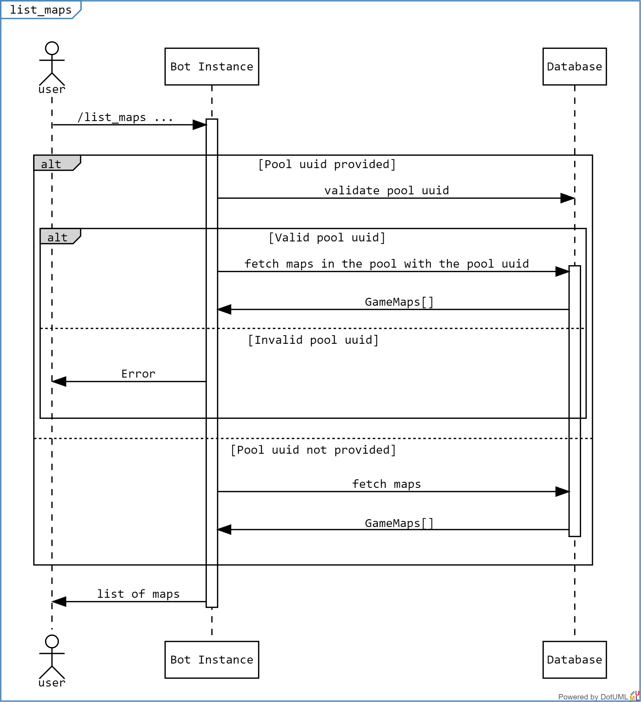
12. `list_pools`
      1. Purpose: list all the pools in a server. Displays an embed
      2. Constraints: This command must be used in a guild. This command should only show pools that belong to the server in which this command is run.
      3. Actors: Admins, Mods, Users.
      4. Parameters:
      5. Normal Flow: fetch all the `Pool`s in the server that this command is used in, and display an embed.
      6. Sequence Diagram: 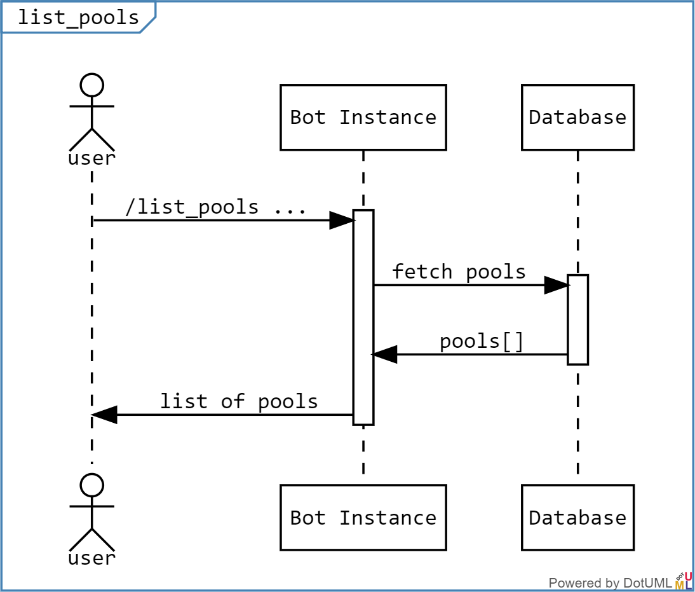
13. `show_map`
      1. Purpose: show an embed with this map and its statistics.
      2. Constraints: This command must be used in a guild. This command should only show maps that
      3. Actors: Admins, Mods, Users.
      4. Parameters:
         1. map_uuid: show the statistics and preview of this map (if available)
      5. Normal Flow: fetch the `GameMap` with this uuid and show its stats and preview.
      6. Alternate Flow: If no `GameMap` with this uuid is found, return an appropriate message.
      7. Sequence Diagram: 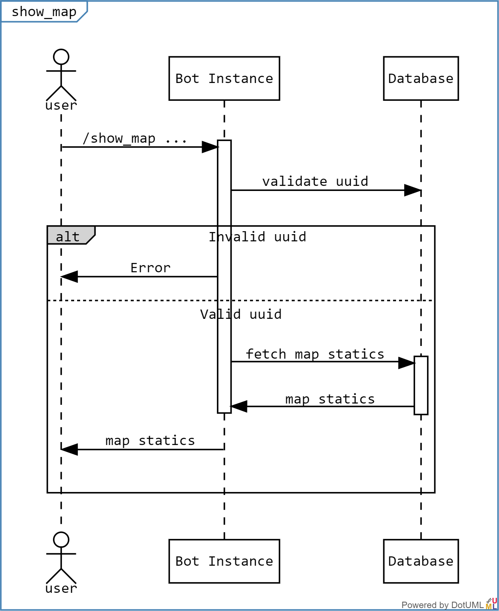
14. `top`
     1. Purpose: show an embed with the top players of this month (or all time).
     2. Constraints: This command must be used in a channel in a guild. This command should only show the top players from a leaderboard that belongs to the server that this command is run in
     3. Actors: Admins, Mods, Users.
     4. Parameters:
         1. queue_uuid: (optional) use the leaderboard from this queue
         2. leaderboard_uuid: (optional) use this leaderboard
         3. all_time: (default: `false`) if `true`, see all time top players instead of just from the 1st of the current month
         4. by_win_rate: (default: `true`) if `false` see the top players by number of games played
     5. Normal Flow: fetch all the `Queue`s in the channel that this command is used in. If there is just one queue, use the `Leaderboard` from this queue to display the top players.
     6. Alternate Flow: If there are multiple queues and `queue_uuid` or `leaderboard_uuid` is unspecified, return a message asking the user to specify the `queue_uuid` or the `leaderboard_uuid` that they want to see the top players from.
15. `list_matches`
     1. Purpose: show a (probably paged) embed with the matches and map of that match.
     2. Constraints: This command must be used in a channel in a guild. This command should only show matches from leaderboards that belong to the server that this command is run in.
     3. Actors: Admins, Mods, Users.
     4. Parameters:
         1. queue_uuid: (optional) use the leaderboard from this queue
         2. leaderboard_uuid: (optional) use this leaderboard
     5. Normal Flow: fetch all the `Queue`s in the channel that this command is used in. If there is just one queue, use the `Leaderboard` from this queue to display the matches.
     6. Alternate Flow: If there are multiple queues and `queue_uuid` or `leaderboard_uuid` is unspecified, return a message asking the user to specify the `queue_uuid` or the `leaderboard_uuid` that they want to see the matches from.
16. `show_match`
     1. Purpose: show an embed with the map, players, civs, ratings, winners and lobby id (if available) of this match.
     2. Constraints: This command must be used in a channel in a guild. This command should only show a match which is on a leaderboard that belongs to the server that this command runs in.
     3. Actors: Admins, Mods, Users.
     4. Parameters:
         1. match_uuid: show the match with this `uuid`
     5. Normal Flow: fetch the map with the given `uuid` and show the embed.
     6. Alternate Flow: If the given `uuid` is invalid, return an appropriate error message.
17. `last_match`
     1. Purpose: show the last match of the user
     2. Constraints: This command must be used in a channel in a guild.
     3. Actors: Admins, Mods, Users.
     4. Parameters:
         1. user: (optional) show the last match of this user. If unspecified, show the last match of the user of this command
         2. queue_uuid: (optional) use the leaderboard from this queue
         3. leaderboard_uuid: (optional) use this leaderboard to find the last match of the user
     5. Normal Flow: fetch all the `Queue`s in the channel that this command is used in. If there is just one queue, use the `Leaderboard` from this queue to display the last match.
     6. Alternate Flow: If there are multiple queues and `queue_uuid` or `leaderboard_uuid` is unspecified, return a message asking the user to specify the `queue_uuid` or the `leaderboard_uuid` that they want to see the last match from.
18. `promote`
     1. Purpose: pings the promotion role as set by the `promotionRoleId` to beckon users to play a game.
     2. Constraints: This command must be used in a channel in a guild. This command must only be allowed to use once every `promotionCooldown` seconds specified by the `Guild` instance.
     3. Actors: Admins, Mods, Users.
     4. Parameters:
     5. Normal Flow: Ping the promotion role.
     6. Alternate Flow 1: If the promotion role is not set, show an appropriate error message
     7. Alternate Flow 2: If the current time is not at least `promotionCooldown` seconds after the `lastPromotion` of the `Guild` instance, show a message saying that the promotion is not allowed.
19. `promo_sub`
     1. Purpose: allow a user to add themselves to the promotion role (if set) of the `Guild`.
     2. Constraints: This command must be used in a channel in a guild.
     3. Actors: Admins, Mods, Users.
     4. Parameters:
         1. enable: `true/false`.
     5. Normal Flow: Give/Take the promotion role to/from this user in the server where this command is used.
     6. Alternate Flow: If the promotion role is not set, show an appropriate error message
20. `list_bans`
     1. Purpose: Allow a user to see the names of all the banned users and the reasons for their bans and the time left until the ban expires. Displays an embed.
     2. Constraints: This command must be used in a channel in a guild. This command must only show the bans from the server where this command is run
     3. Actors: Admins, Mods, Users.
     4. Parameters:
     5. Normal Flow: show an embed with the names of the banned players, the reasons for their bans and the timer until when the ban lasts.
21. `sub_me`
     1. Purpose: Allow a user to substitute themselves after a game has started IF another user is available. This is only meaningful before the start of the game
     2. Constraints: This command must be used in a channel in a guild. This command must only allow substitution when the voting procedure has started/the teams are already formed.
     3. Actors: Admins, Mods, Users.
     4. Parameters:
         1. for: (optional) If unspecified, the user of this command is looking to replace themselves. If specified, the user of this command wants to take the place of this user.
     5. Normal Flow: Add the name of the player to looking for sub.
22. `link`
     1. Purpose: link this user's steam/aoe2.net profile to their discord ID
     2. Constraints: This command must be used in a channel in a guild.
     3. Actors: Admins, Mods, Users.
     4. Parameters:
         1. steam: (optional) user's steam ID
         2. aoe2net: (optional) user's aoe2net ID.
     5. Normal Flow: Store the.
23. `unlink` command specifics yet to be decided
24. `elo_graph` command specifics yet to be decided
25. `phrase`
     1. Purpose: allow the user to set a phrase for a specific queue which will be shown when the user joins this queue.
     2. Constraints: This command must be used in a guild.
     3. Actors: Admins, Mods, Users.
     4. Parameters:
         1. queue_uuid: set to this queue
         2. phrase: phrase to set
     5. Normal Flow: Set the phrase to the user and the queue.
     6. Alternate Flow: Return an appropriate message if the queue with `queue_uuid` is not found.
26. `toss`
     1. Purpose: flip a coin.
     2. Constraints:
     3. Actors: Admins, Mods, Users.
     4. Parameters:
     5. Normal Flow: Flip a coin and show the result (heads/tails).
27. `random`
     1. Purpose: get a random number.
     2. Constraints:
     3. Actors: Admins, Mods, Users.
     4. Parameters:
         1. min: the minimum boundary
         2. max: the maximum boundary
28. `ask` command specifics yet to be decided
